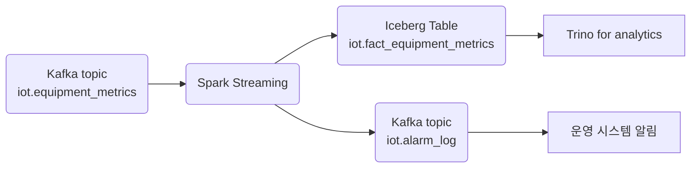

+++
title = "[Fact] equipment_metrics"
draft = false
+++
## 개요
항목 | 설명
-|-
목적|설비 상태(온도, 진동, 압력 등)의 실시간 수집 및 이상 탐지
발생 주기 | 초당 1~5건(설비당), 수천 대 설비 스케일 대응
주요 활용처 | 알람 시스템, 정비 예측, 품질 관리 시스템과 연계

#### Message Schema(Kafka / Avro)
```json
{
  "timestamp": "2025-05-24T13:00:00Z",
  "equipment_id": "LINE_A_PRESS_001",
  "equipment_type": "hydraulic_press",
  "location": "line_a",
  "schema_version": "v1.2",
  "metrics": [
    {
      "sensor_id": "TEMP_SENSOR_001",
      "sensor_type": "temperature",
      "value": 68.2,
      "unit": "celsius",
      "quality": "good"
    },
    {
      "sensor_id": "VIB_SENSOR_001",
      "sensor_type": "vibration",
      "value": 0.8,
      "unit": "mm/s",
      "quality": "good"
    }
  ],
  "status": {
    "current": "running",
    "previous": "idle",
    "changed_at": "2025-05-24T12:58:30Z"
  },
  "operator_id": "OP001",
  "batch_id": "BATCH_20250524_001",
  "ingestion_timestamp": "2025-05-24T13:00:02Z"
}
```

#### 이상 탐지 처리 흐름 (Spark)
- Join 대상: dim_thresholds (설비+센서+시즌+제품+교대 기준 임계값)
- 처리 방식: Watermark 15분 + 상태 전이 비교 + 동적 임계값
```scala
.withColumn("anomaly", $"value" < $"min_threshold" || $"value" > $"max_threshold")
```

#### Iceberg 저장 전략
항목 | 내용
-|-
테이블명 | iot.fact_equipment_metrics
파티셔닝 | days(timestamp), bucket(16, equipment_id)
테이블 유형 | Append-only, MERGE INTO 지원 준비
적재 주기 | 실시간 스트리밍 적재 (Trigger = ProcessingTime 10s)
스토리지 | GCS
보관 기간 | 365일 (Time Travel + Metadata Clean 주기 분리)

#### Kafka Topic 구성
```yaml
iot.equipment_metrics:
  partitions: 20
  replication-factor: 3
  compression.type: lz4
  retention.ms: 604800000  # 7일

iot.equipment_metrics.dlq:
  partitions: 5
  retention.ms: 2592000000 # 30일
```

#### DLQ 설계
유형 | 조건 예시 | 처리 방식
-|-|-
schema_error | required field 누락 / 타입 오류 | DLQ 전송 + Slack 알림
business_rule_violation|센서 품질 “bad”, 측정값 ±99% 이상|DLQ 전송 + Grafana 경고
duplicate|동일 equipment_id + sensor_type + timestamp 중복|Kafka Header로 중복검출
late_arrival|ingestion_timestamp - timestamp > 10min|로그 + DLQ 기록

#### 주요 모니터링 지표
```yaml
spark_streaming_input_rate: 초당 수신 메시지 수
spark_streaming_processing_time: 배치 처리 시간
kafka_lag_max: 최대 consumer lag
iceberg_write_latency_p99: 99퍼센트ile 적재 지연
equipment_anomaly_rate: 이상 측정 비율
late_arrival_count: 지연 도착 메시지 건수
```

#### SLA 기준
항목 | 기준
-|-
Kafka ingest -> Spark 처리 지연 | $<= 5s$
Spark 처리 -> Iceberg 적재 지연 | $<= 10s$
이상 감지 후 알림 전파 시간 | $3s$
최대 처리량 | 초당 5,000건
DLQ 비율 | $<= 0.1%$ 권장

#### 연계 도메인 및 데이터 흐름


#### 관련 Dimension Table
테이블명 | 주요 컬럼
-|-
dim_equipment|equipment_id, type, install_date, location
dim_operator|operator_id, name, shift
dim_thresholds|equipment_id, sensor_type, min, max, 조건들
dim_location|location, zone, site
