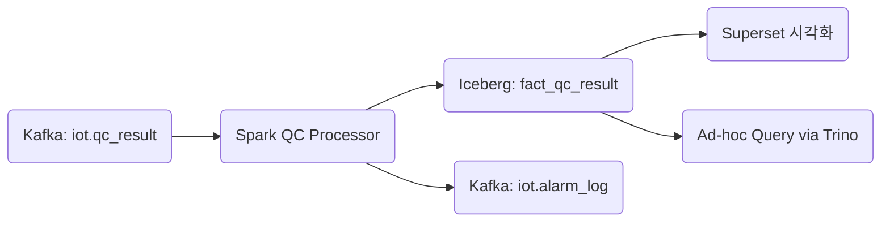

+++
title = "[Fact] qc_result"
draft = false
+++
#### 도메인 개요
항목 | 설명
-|-
목적 | 생산 공정 중 검사 장비에서 수집된 품질 검사 결과를 이벤트로 기록하고, 이상 항목을 식별하여 품질/정비 시스템에 전달함
발생 주기 | 제품 1개당 1건. 초당 수~수십 건 이상 발생 가능 (라인 병렬 기준)
주요 연계 도메인 | equipment_metrics, alarm_log, dim_batch, dim_inspection_item, dim_qc_threshold


#### 메시지 스키마(Kafka/Avro)
```json
{
  "timestamp": "2025-05-24T14:10:00Z",
  "equipment_id": "LINE_B_VISION_001",
  "inspection_type": "vision",
  "product_code": "P12345678",
  "batch_id": "BATCH_20250524_002",
  "operator_id": "OP001",
  "location": "line_b",
  "inspection_items": [
    {
      "item_id": "WIDTH",
      "value": 15.3,
      "unit": "mm"
    },
    {
      "item_id": "SCRATCH",
      "value": 2,
      "unit": "count"
    }
  ],
  "schema_version": "v2.0",
  "ingestion_timestamp": "2025-05-24T14:10:04Z"
}
```

#### 이상 탐지 처리 흐름(Spark)
항목 | 내용
-|-
기준 테이블 | dim_qc_threshold
Join Key | item_id, product_code, inspection_type
이상 조건 | value < min_threshold OR value > max_threshold
알람 발행 대상 | 이상 발생 시 Kafka: iot.alarm_log에 발행
DLQ 조건 | 누락 필드, 기준 없음, 단위 불일치, 타입 오류 등
```scala
.withColumn("defect", $"value" < $"min_threshold" || $"value" > $"max_threshold")
```


#### Iceberg 저장 전략
항목 | 내용
-|-
테이블명 | iot.fact_qc_result
파티셔닝 | days(timestamp), bucket(16, equipment_id)
테이블 구조 | 검사 항목별 explode(inspection_items) 후 1 row 1 항목 적재
MERGE 전략 | Spark upsert 처리 가능: batch_id + item_id + timestamp 기준 dedup
보관 정책 | 365일 + Time Travel / Compaction 주기적 적용

#### Kafka Topic 구성
```yaml
iot.qc_result:
  partitions: 12
  replication-factor: 3
  compression.type: lz4
  retention.ms: 1209600000  # 14일

iot.qc_result.dlq:
  partitions: 4
  retention.ms: 2592000000  # 30일
```

#### DLQ 설계
유형 | 조건 예시 | 처리 방식
-|-|-
스키마 오류 | item_id 누락, unit 없음 등 | schema_error DLQ
기준 없음 | item_id + product_code → 기준 없음 | threshold_missing DLQ
단위 불일치 | 측정단위와 기준단위 불일치 (예: mm vs cm) | unit_mismatch DLQ
late arrival (지연도착) | ingestion_timestamp - timestamp > 10분 | late_arrival DLQ

#### 주요 모니터링 지표
```yaml
qc_defect_rate: 불량률 (%)
qc_threshold_miss_rate: 기준값 누락률
qc_unit_mismatch_count: 단위 불일치 건수
qc_operator_repeat_defect: 동일 작업자 반복 불량
```

#### SLA 기준
항목 | 기준
-|-
Kafka ingest → Spark 지연 | ≤ 5초
Spark 처리 → Iceberg 적재 | ≤ 10초
이상 감지 후 알람 전파 시간 | ≤ 3초
최대 처리량 | 초당 3,000건 이상
기준 없는 항목 비율 | ≤ 0.5%


#### 연계 흐름


#### 관련 Dimension Table
테이블명 | 주요 컬럼
-|-
dim_batch | batch_id, product_code, 생산 시작/종료 시간 등
dim_inspection_item | item_id, item_name, unit, 검사 방식
dim_qc_threshold | item_id, product_code, inspection_type, min, max, unit
dim_equipment | equipment_id, equipment_type, location
dim_operator | operator_id, name, 자격 등급, 근무조 등
