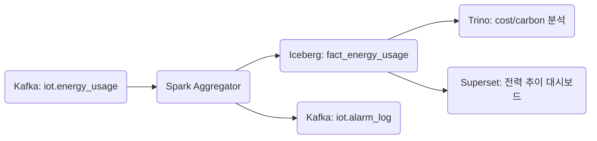

+++
title = "[Fact] energy_usage"
draft = false
+++
## 개요
항목 | 설명
-|-
목적 | 설비별 에너지 소비량(전기, 스팀, 가스 등)의 수집, 비용 예측, 이상 감지 및 탄소 배출 분석
발생 주기 | 1~10분 주기 보고, 설비별 또는 라인 단위 (설비 병렬화 시 TPS 수천 이상 가능)
주요 연계 | dim_equipment, dim_energy_type, dim_energy_threshold, maintenance_log

#### 메시지 스키마(Kafka/Avro)
```json
{
  "timestamp": "2025-05-24T14:15:00Z",
  "equipment_id": "LINE_C_PRESS_003",
  "energy_type": "electricity",
  "usage": 12.7,
  "unit": "kWh",
  "location": "line_c",
  "batch_id": "BATCH_20250524_002",
  "schema_version": "v1.1",
  "ingestion_timestamp": "2025-05-24T14:15:03Z"
}
```

#### 이상 탐지 처리 흐름(Spark)
항목 | 내용
-|-
기준 테이블 | dim_energy_threshold
Join 기준 | equipment_id + energy_type
이상 조건 | usage > max_threshold 또는 unit ≠ expected_unit
알람 트리거 | 연속 3회 이상 초과 or 특정 시간대 피크 초과
DLQ 사유 분류 | schema_error, unit_mismatch, threshold_missing, late_arrival
```scala
.withColumn("anomaly", $"usage" > $"max_threshold")
.withColumn("unit_mismatch", $"unit" =!= $"expected_unit")
```

#### Iceberg 저장 전략
항목 | 내용
-|-
테이블명 | iot.fact_energy_usage
파티셔닝 | days(timestamp), bucket(16, equipment_id)
테이블 유형 | Append-only + MERGE 지원 구조
적재 지연 허용 | Watermark 10분 적용 예정
보관 정책 | 365일 + compaction / metadata cleanup 주기 운영

#### Kafka Topic 구성
```yaml
iot.energy_usage:
  partitions: 12
  replication-factor: 3
  compression.type: zstd
  retention.ms: 1209600000  # 14일

iot.energy_usage.dlq:
  partitions: 4
  retention.ms: 2592000000  # 30일
```

#### 주요 모니터링 지표
```yaml
iot_energy_usage_total: 전체 소비량
iot_energy_cost_prediction: 예상 vs 실제 요금
iot_energy_peak_over_count: 기준 초과 횟수
iot_energy_unit_mismatch: 단위 불일치 건수
iot_energy_carbon_emission: 탄소 배출량 예측치
```

#### SLA 기준
항목 | 기준
-|-
Kafka ingest → Spark 처리 지연 | ≤ 5초
Spark 처리 → Iceberg 적재 지연 | ≤ 10초
DLQ 비율 | ≤ 0.05%
처리량 유지 | 초당 5,000건 이상 처리 보장
알람 전파 지연 | ≤ 3초


#### 연계 흐름


#### 관련 Dimension Table
dim_energy_type
필드명 | 설명
-|-
energy_type | 전력, 스팀, 가스 등 (enum)
standard_unit | 기준 단위 (예: kWh, m³)
conversion_rate | 환산 비율 (예: Wh → kWh = 0.001)
carbon_factor | 탄소 환산계수 (gCO2 per 단위)
cost_per_unit | 요금 정보

dim_energy_threshold
필드명 | 설명
-|-
equipment_id | 설비 ID
energy_type | 전력/가스/스팀 등
max_threshold | 초과 기준
expected_unit | 기준 단위
valid_from, valid_to | 적용 기간 (스냅샷용)


