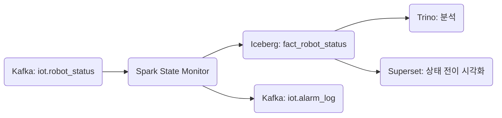

+++
title = "Flink to GCS"
draft = false
+++
#### 도메인 개요
항목 | 설명
-|-
목적 | 공장 내 로봇의 상태 전이, 에러, 배터리 수준, 위치 흐름을 수집하고 장애 감지 및 운영 최적화에 활용
발생 주기 | 초당 1~3건, 수천 대 병렬로 운영될 수 있음
주요 연계 | dim_robot, dim_location, dim_robot_error_code, alarm_log, robot_heartbeat


#### 메시지 스키마(Kafka/Avro)
```json
{
  "timestamp": "2025-05-24T14:20:00Z",
  "robot_id": "ROBOT_005",
  "model": "agv_type_c",
  "status": {
    "current": "error",
    "previous": "moving",
    "changed_at": "2025-05-24T14:19:40Z"
  },
  "location": "zone_4",
  "battery_level": 23.5,
  "error_code": "E405",
  "task_id": "TSK_20250524_018",
  "schema_version": "v2.0",
  "ingestion_timestamp": "2025-05-24T14:20:03Z"
}
```

#### 이상 탐지 처리 흐름(Spark)
항목 | 내용
-|-
상태 enum 고정 | "idle", "moving", "charging", "error"
이상 조건 | status.current = "error" OR battery_level < 20 OR error_code IS NOT NULL
오프라인 탐지 | heartbeat_timeout_minutes = 10 기준, 미보고 시 DLQ or 알람
DLQ 분리 | schema_error, invalid_enum, unit_violation, missing_error_code, offline_timeout
알람 전파 | 이상 발생 시 iot.alarm_log 토픽으로 발행


#### Iceberg 저장 전략
항목 | 내용
-|-
테이블명 | iot.fact_robot_status
파티셔닝 | days(timestamp), bucket(16, robot_id)
구조 정리 | status.* flatten, task_id nullable
중복 제거 키 | robot_id + timestamp 기준 중복 제거 가능


#### Kafka Topic 구성
```yaml
iot.robot_status:
  partitions: 12
  replication-factor: 3
  compression.type: zstd
  retention.ms: 604800000  # 7일

iot.robot_status.dlq:
  partitions: 4
  retention.ms: 2592000000  # 30일
```

#### DLQ 설계

#### 주요 모니터링 지표
```yaml
robot_state_error_count
robot_battery_low_alerts
robot_state_transition_rate
robot_offline_timeout_count
robot_avg_battery_drain_per_hour
robot_status_enum_violation
```

#### SLA 기준
항목 | 기준
-|-
상태 보고 지연 허용 | ≤ 3초
Spark 처리 후 Iceberg 적재 지연 | ≤ 10초
상태 오류 감지 후 알람 지연 | ≤ 3초
DLQ 비율 | ≤ 0.1%


#### 연계 흐름


#### 관련 Dimension Table
dim_robot
필드명 | 설명
-|-
robot_id | 고유 로봇 ID
model | AGV / 팔로봇 / 드론 등
install_date | 설치일
heartbeat_cycle | 정상 보고 주기 (초 단위)
team | 관리 부서

dim_location
필드명 | 설명
-|-
location | 공장 내 위치 (zone_1 ~ zone_n)
area_type | 작업 구역 / 충전소 / 대기 공간 등

dim_robot_error_code
필드명 | 설명
-|-
error_code | "E405" 등 코드
description | "서보 모터 과열" 등 설명
severity | "critical", "warn" 등