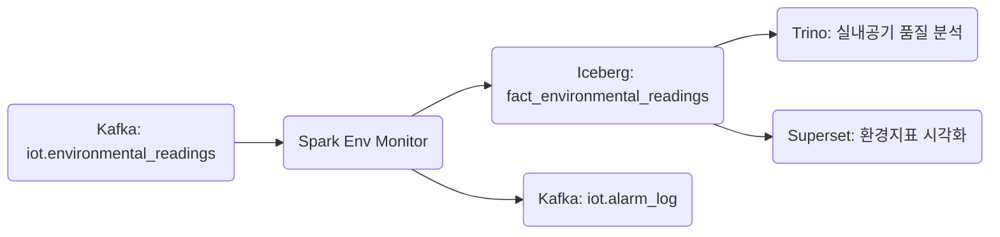

+++
title = "Flink to GCS"
draft = false
+++
#### 도메인 개요
항목 | 설명
-|-
목적 | 생산/작업 구역의 환경 데이터(온도, 습도, CO₂ 등)를 수집하고 기준 초과 감지 및 생산 품질 상관 분석에 활용
발생 주기 | 1~10분 간격, Zone 단위 / 작업장 단위
주요 연계 | dim_location, dim_env_sensor, dim_env_threshold, alarm_log

#### 메시지 스키마(Kafka/Avro)
```json
{
  "timestamp": "2025-05-24T14:30:00Z",
  "location": "line_d_zone_1",
  "readings": [
    {
      "sensor_id": "ENV_TEMP_01",
      "sensor_type": "temperature",
      "value": 29.8,
      "unit": "C"
    },
    {
      "sensor_id": "ENV_CO2_01",
      "sensor_type": "co2",
      "value": 1100,
      "unit": "ppm"
    }
  ],
  "schema_version": "v1.0",
  "ingestion_timestamp": "2025-05-24T14:30:04Z"
}
```

#### 이상 탐지 처리 흐름(Spark)
항목 | 내용
-|-
기준 테이블 | dim_env_threshold
Join Key | sensor_type + location
이상 조건 | value > max_threshold OR value < min_threshold
단위 불일치 | unit ≠ expected_unit (예: °C vs ℉)
연속 이상 감지 | CO₂ 3회 이상 초과 시 알람 전파
DLQ 유형 분리 | schema_error, unit_mismatch, threshold_missing, late_arrival

```scala
.withColumn("is_anomaly", $"value" > $"max_threshold" || $"value" < $"min_threshold")
.withColumn("unit_mismatch", $"unit" =!= $"expected_unit")
```


#### Iceberg 저장 전략
항목 | 내용
-|-
테이블명 | iot.fact_environmental_readings
파티셔닝 | days(timestamp), location
테이블 구조 | explode(readings) → sensor 1건 = row 1건
MERGE 전략 | sensor_id + timestamp 기준 중복 제거 가능


#### Kafka Topic 구성
```yaml
iot.environmental_readings:
  partitions: 8
  replication-factor: 3
  compression.type: zstd
  retention.ms: 1209600000  # 14일

iot.environmental_readings.dlq:
  partitions: 3
  retention.ms: 2592000000  # 30일
```


#### 주요 모니터링 지표
```yaml
env_anomaly_count_by_location
env_co2_over_1000_ppm_count
env_temperature_range_breach
env_unit_mismatch_count
env_missing_threshold_ratio
```

#### SLA 기준
항목 | 기준
-|-
ingest → Spark 처리 지연 | ≤ 5초
Spark → Iceberg 적재 지연 | ≤ 10초
이상 감지 후 알람 전파 지연 | ≤ 3초
DLQ 비율 | ≤ 0.2%


#### 연계 흐름



#### 관련 Dimension Table
dim_env_sensor
필드명 | 설명
-|-
sensor_id | 고유 센서 ID
sensor_type | 온도 / 습도 / CO₂ 등
unit | 측정 단위
accuracy | 신뢰도 ±값
install_date | 설치일

dim_env_threshold
필드명 | 설명
-|-
sensor_type | 센서 타입 (co2, temperature 등)
location | 적용 위치 (zone 단위)
min_threshold | 최소 허용값
max_threshold | 최대 허용값
expected_unit | 기준 단위 (예: C, ppm)
valid_from/to | 적용 기간 (시즌별 기준 스냅샷 대응 가능)

dim_location
필드명 | 설명
-|-
location | zone_1, zone_2 …
site | 공장명 / 물류센터명
area_type | 작업장 / 휴게실 / 충전소 등