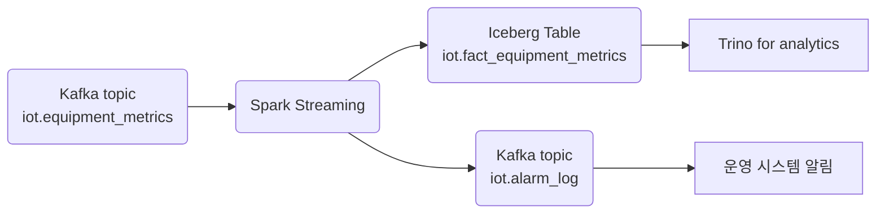
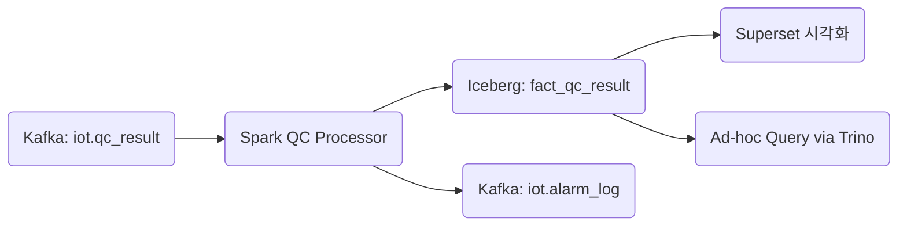
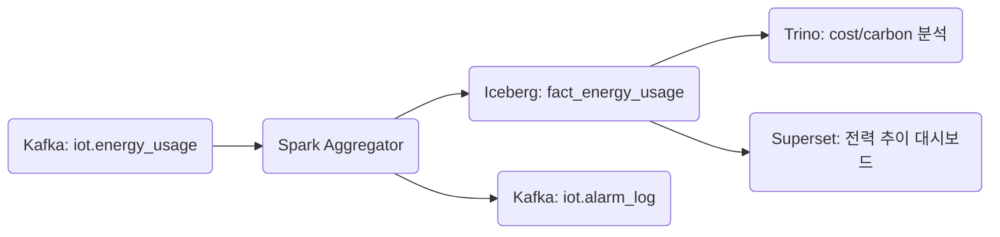
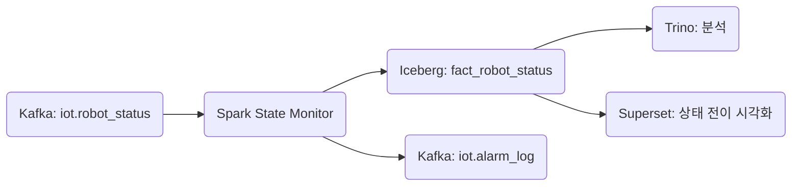
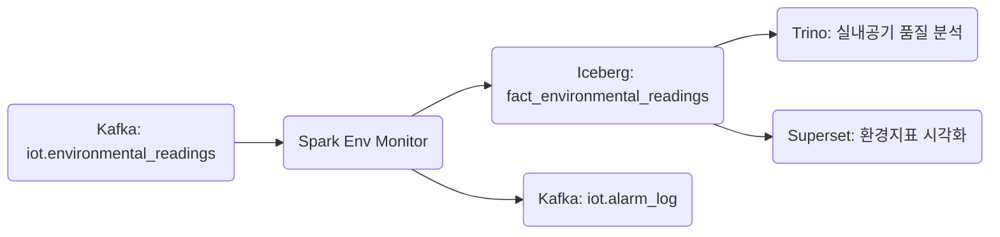
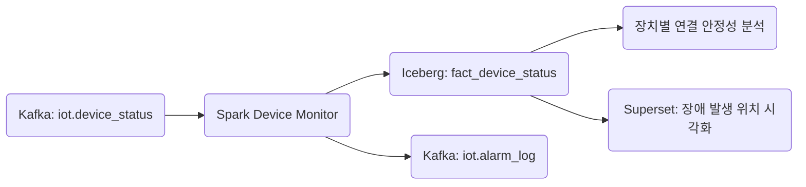

+++
title = "[Fact] Total"
draft = false
+++

# 1. equpiment_metrics

#### [도메인 개요]
항목 | 설명
-|-
목적|설비 상태(온도, 진동, 압력 등)의 실시간 수집 및 이상 탐지
발생 주기 | 초당 1~5건(설비당), 수천 대 설비 스케일 대응
주요 활용처 | 알람 시스템, 정비 예측, 품질 관리 시스템과 연계

#### Message Schema(Kafka / Avro)
```json
{
  "timestamp": "2025-05-24T13:00:00Z",
  "equipment_id": "LINE_A_PRESS_001",
  "equipment_type": "hydraulic_press",
  "location": "line_a",
  "schema_version": "v1.2",
  "metrics": [
    {
      "sensor_id": "TEMP_SENSOR_001",
      "sensor_type": "temperature",
      "value": 68.2,
      "unit": "celsius",
      "quality": "good"
    },
    {
      "sensor_id": "VIB_SENSOR_001",
      "sensor_type": "vibration",
      "value": 0.8,
      "unit": "mm/s",
      "quality": "good"
    }
  ],
  "status": {
    "current": "running",
    "previous": "idle",
    "changed_at": "2025-05-24T12:58:30Z"
  },
  "operator_id": "OP001",
  "batch_id": "BATCH_20250524_001",
  "ingestion_timestamp": "2025-05-24T13:00:02Z"
}
```

#### 이상 탐지 처리 흐름 (Spark)
- Join 대상: dim_thresholds (설비+센서+시즌+제품+교대 기준 임계값)
- 처리 방식: Watermark 15분 + 상태 전이 비교 + 동적 임계값
```scala
.withColumn("anomaly", $"value" < $"min_threshold" || $"value" > $"max_threshold")
```

#### Iceberg 저장 전략
항목 | 내용
-|-
테이블명 | iot.fact_equipment_metrics
파티셔닝 | days(timestamp), bucket(16, equipment_id)
테이블 유형 | Append-only, MERGE INTO 지원 준비
적재 주기 | 실시간 스트리밍 적재 (Trigger = ProcessingTime 10s)
스토리지 | GCS
보관 기간 | 365일 (Time Travel + Metadata Clean 주기 분리)

#### Kafka Topic 구성
```yaml
iot.equipment_metrics:
  partitions: 20
  replication-factor: 3
  compression.type: lz4
  retention.ms: 604800000  # 7일

iot.equipment_metrics.dlq:
  partitions: 5
  retention.ms: 2592000000 # 30일
```

#### DLQ 설계
유형 | 조건 예시 | 처리 방식
-|-|-
schema_error | required field 누락 / 타입 오류 | DLQ 전송 + Slack 알림
business_rule_violation|센서 품질 “bad”, 측정값 ±99% 이상|DLQ 전송 + Grafana 경고
duplicate|동일 equipment_id + sensor_type + timestamp 중복|Kafka Header로 중복검출
late_arrival|ingestion_timestamp - timestamp > 10min|로그 + DLQ 기록

#### 주요 모니터링 지표
```yaml
spark_streaming_input_rate: 초당 수신 메시지 수
spark_streaming_processing_time: 배치 처리 시간
kafka_lag_max: 최대 consumer lag
iceberg_write_latency_p99: 99퍼센트ile 적재 지연
equipment_anomaly_rate: 이상 측정 비율
late_arrival_count: 지연 도착 메시지 건수
```

#### SLA 기준
항목 | 기준
-|-
Kafka ingest -> Spark 처리 지연 | $<= 5s$
Spark 처리 -> Iceberg 적재 지연 | $<= 10s$
이상 감지 후 알림 전파 시간 | $3s$
최대 처리량 | 초당 5,000건
DLQ 비율 | $<= 0.1%$ 권장

#### 연계 도메인 및 데이터 흐름


#### 관련 Dimension Table
테이블명 | 주요 컬럼
-|-
dim_equipment|equipment_id, type, install_date, location
dim_operator|operator_id, name, shift
dim_thresholds|equipment_id, sensor_type, min, max, 조건들
dim_location|location, zone, site


# 2. qc_result
#### 도메인 개요
항목 | 설명
-|-
목적 | 생산 공정 중 검사 장비에서 수집된 품질 검사 결과를 이벤트로 기록하고, 이상 항목을 식별하여 품질/정비 시스템에 전달함
발생 주기 | 제품 1개당 1건. 초당 수~수십 건 이상 발생 가능 (라인 병렬 기준)
주요 연계 도메인 | equipment_metrics, alarm_log, dim_batch, dim_inspection_item, dim_qc_threshold


#### 메시지 스키마(Kafka/Avro)
```json
{
  "timestamp": "2025-05-24T14:10:00Z",
  "equipment_id": "LINE_B_VISION_001",
  "inspection_type": "vision",
  "product_code": "P12345678",
  "batch_id": "BATCH_20250524_002",
  "operator_id": "OP001",
  "location": "line_b",
  "inspection_items": [
    {
      "item_id": "WIDTH",
      "value": 15.3,
      "unit": "mm"
    },
    {
      "item_id": "SCRATCH",
      "value": 2,
      "unit": "count"
    }
  ],
  "schema_version": "v2.0",
  "ingestion_timestamp": "2025-05-24T14:10:04Z"
}
```

#### 이상 탐지 처리 흐름(Spark)
항목 | 내용
-|-
기준 테이블 | dim_qc_threshold
Join Key | item_id, product_code, inspection_type
이상 조건 | value < min_threshold OR value > max_threshold
알람 발행 대상 | 이상 발생 시 Kafka: iot.alarm_log에 발행
DLQ 조건 | 누락 필드, 기준 없음, 단위 불일치, 타입 오류 등
```scala
.withColumn("defect", $"value" < $"min_threshold" || $"value" > $"max_threshold")
```


#### Iceberg 저장 전략
항목 | 내용
-|-
테이블명 | iot.fact_qc_result
파티셔닝 | days(timestamp), bucket(16, equipment_id)
테이블 구조 | 검사 항목별 explode(inspection_items) 후 1 row 1 항목 적재
MERGE 전략 | Spark upsert 처리 가능: batch_id + item_id + timestamp 기준 dedup
보관 정책 | 365일 + Time Travel / Compaction 주기적 적용

#### Kafka Topic 구성
```yaml
iot.qc_result:
  partitions: 12
  replication-factor: 3
  compression.type: lz4
  retention.ms: 1209600000  # 14일

iot.qc_result.dlq:
  partitions: 4
  retention.ms: 2592000000  # 30일
```

#### DLQ 설계
유형 | 조건 예시 | 처리 방식
-|-|-
스키마 오류 | item_id 누락, unit 없음 등 | schema_error DLQ
기준 없음 | item_id + product_code → 기준 없음 | threshold_missing DLQ
단위 불일치 | 측정단위와 기준단위 불일치 (예: mm vs cm) | unit_mismatch DLQ
late arrival (지연도착) | ingestion_timestamp - timestamp > 10분 | late_arrival DLQ

#### 주요 모니터링 지표
```yaml
qc_defect_rate: 불량률 (%)
qc_threshold_miss_rate: 기준값 누락률
qc_unit_mismatch_count: 단위 불일치 건수
qc_operator_repeat_defect: 동일 작업자 반복 불량
```

#### SLA 기준
항목 | 기준
-|-
Kafka ingest → Spark 지연 | ≤ 5초
Spark 처리 → Iceberg 적재 | ≤ 10초
이상 감지 후 알람 전파 시간 | ≤ 3초
최대 처리량 | 초당 3,000건 이상
기준 없는 항목 비율 | ≤ 0.5%


#### 연계 흐름


#### 관련 Dimension Table
테이블명 | 주요 컬럼
-|-
dim_batch | batch_id, product_code, 생산 시작/종료 시간 등
dim_inspection_item | item_id, item_name, unit, 검사 방식
dim_qc_threshold | item_id, product_code, inspection_type, min, max, unit
dim_equipment | equipment_id, equipment_type, location
dim_operator | operator_id, name, 자격 등급, 근무조 등

# 3. energy_usage
#### 도메인 개요
항목 | 설명
-|-
목적 | 설비별 에너지 소비량(전기, 스팀, 가스 등)의 수집, 비용 예측, 이상 감지 및 탄소 배출 분석
발생 주기 | 1~10분 주기 보고, 설비별 또는 라인 단위 (설비 병렬화 시 TPS 수천 이상 가능)
주요 연계 | dim_equipment, dim_energy_type, dim_energy_threshold, maintenance_log

#### 메시지 스키마(Kafka/Avro)
```json
{
  "timestamp": "2025-05-24T14:15:00Z",
  "equipment_id": "LINE_C_PRESS_003",
  "energy_type": "electricity",
  "usage": 12.7,
  "unit": "kWh",
  "location": "line_c",
  "batch_id": "BATCH_20250524_002",
  "schema_version": "v1.1",
  "ingestion_timestamp": "2025-05-24T14:15:03Z"
}
```

#### 이상 탐지 처리 흐름(Spark)
항목 | 내용
-|-
기준 테이블 | dim_energy_threshold
Join 기준 | equipment_id + energy_type
이상 조건 | usage > max_threshold 또는 unit ≠ expected_unit
알람 트리거 | 연속 3회 이상 초과 or 특정 시간대 피크 초과
DLQ 사유 분류 | schema_error, unit_mismatch, threshold_missing, late_arrival
```scala
.withColumn("anomaly", $"usage" > $"max_threshold")
.withColumn("unit_mismatch", $"unit" =!= $"expected_unit")
```

#### Iceberg 저장 전략
항목 | 내용
-|-
테이블명 | iot.fact_energy_usage
파티셔닝 | days(timestamp), bucket(16, equipment_id)
테이블 유형 | Append-only + MERGE 지원 구조
적재 지연 허용 | Watermark 10분 적용 예정
보관 정책 | 365일 + compaction / metadata cleanup 주기 운영

#### Kafka Topic 구성
```yaml
iot.energy_usage:
  partitions: 12
  replication-factor: 3
  compression.type: zstd
  retention.ms: 1209600000  # 14일

iot.energy_usage.dlq:
  partitions: 4
  retention.ms: 2592000000  # 30일
```

#### 주요 모니터링 지표
```yaml
iot_energy_usage_total: 전체 소비량
iot_energy_cost_prediction: 예상 vs 실제 요금
iot_energy_peak_over_count: 기준 초과 횟수
iot_energy_unit_mismatch: 단위 불일치 건수
iot_energy_carbon_emission: 탄소 배출량 예측치
```

#### SLA 기준
항목 | 기준
-|-
Kafka ingest → Spark 처리 지연 | ≤ 5초
Spark 처리 → Iceberg 적재 지연 | ≤ 10초
DLQ 비율 | ≤ 0.05%
처리량 유지 | 초당 5,000건 이상 처리 보장
알람 전파 지연 | ≤ 3초


#### 연계 흐름


#### 관련 Dimension Table
dim_energy_type
필드명 | 설명
-|-
energy_type | 전력, 스팀, 가스 등 (enum)
standard_unit | 기준 단위 (예: kWh, m³)
conversion_rate | 환산 비율 (예: Wh → kWh = 0.001)
carbon_factor | 탄소 환산계수 (gCO2 per 단위)
cost_per_unit | 요금 정보

dim_energy_threshold
필드명 | 설명
-|-
equipment_id | 설비 ID
energy_type | 전력/가스/스팀 등
max_threshold | 초과 기준
expected_unit | 기준 단위
valid_from, valid_to | 적용 기간 (스냅샷용)

# 4. robot_status
#### 도메인 개요
항목 | 설명
-|-
목적 | 공장 내 로봇의 상태 전이, 에러, 배터리 수준, 위치 흐름을 수집하고 장애 감지 및 운영 최적화에 활용
발생 주기 | 초당 1~3건, 수천 대 병렬로 운영될 수 있음
주요 연계 | dim_robot, dim_location, dim_robot_error_code, alarm_log, robot_heartbeat


#### 메시지 스키마(Kafka/Avro)
```json
{
  "timestamp": "2025-05-24T14:20:00Z",
  "robot_id": "ROBOT_005",
  "model": "agv_type_c",
  "status": {
    "current": "error",
    "previous": "moving",
    "changed_at": "2025-05-24T14:19:40Z"
  },
  "location": "zone_4",
  "battery_level": 23.5,
  "error_code": "E405",
  "task_id": "TSK_20250524_018",
  "schema_version": "v2.0",
  "ingestion_timestamp": "2025-05-24T14:20:03Z"
}
```

#### 이상 탐지 처리 흐름(Spark)
항목 | 내용
-|-
상태 enum 고정 | "idle", "moving", "charging", "error"
이상 조건 | status.current = "error" OR battery_level < 20 OR error_code IS NOT NULL
오프라인 탐지 | heartbeat_timeout_minutes = 10 기준, 미보고 시 DLQ or 알람
DLQ 분리 | schema_error, invalid_enum, unit_violation, missing_error_code, offline_timeout
알람 전파 | 이상 발생 시 iot.alarm_log 토픽으로 발행


#### Iceberg 저장 전략
항목 | 내용
-|-
테이블명 | iot.fact_robot_status
파티셔닝 | days(timestamp), bucket(16, robot_id)
구조 정리 | status.* flatten, task_id nullable
중복 제거 키 | robot_id + timestamp 기준 중복 제거 가능


#### Kafka Topic 구성
```yaml
iot.robot_status:
  partitions: 12
  replication-factor: 3
  compression.type: zstd
  retention.ms: 604800000  # 7일

iot.robot_status.dlq:
  partitions: 4
  retention.ms: 2592000000  # 30일
```

#### 주요 모니터링 지표
```yaml
robot_state_error_count
robot_battery_low_alerts
robot_state_transition_rate
robot_offline_timeout_count
robot_avg_battery_drain_per_hour
robot_status_enum_violation
```

#### SLA 기준
항목 | 기준
-|-
상태 보고 지연 허용 | ≤ 3초
Spark 처리 후 Iceberg 적재 지연 | ≤ 10초
상태 오류 감지 후 알람 지연 | ≤ 3초
DLQ 비율 | ≤ 0.1%


#### 연계 흐름


#### 관련 Dimension Table
dim_robot
필드명 | 설명
-|-
robot_id | 고유 로봇 ID
model | AGV / 팔로봇 / 드론 등
install_date | 설치일
heartbeat_cycle | 정상 보고 주기 (초 단위)
team | 관리 부서

dim_location
필드명 | 설명
-|-
location | 공장 내 위치 (zone_1 ~ zone_n)
area_type | 작업 구역 / 충전소 / 대기 공간 등

dim_robot_error_code
필드명 | 설명
-|-
error_code | "E405" 등 코드
description | "서보 모터 과열" 등 설명
severity | "critical", "warn" 등

# 5. environmental_readings
#### 도메인 개요
항목 | 설명
-|-
목적 | 생산/작업 구역의 환경 데이터(온도, 습도, CO₂ 등)를 수집하고 기준 초과 감지 및 생산 품질 상관 분석에 활용
발생 주기 | 1~10분 간격, Zone 단위 / 작업장 단위
주요 연계 | dim_location, dim_env_sensor, dim_env_threshold, alarm_log

#### 메시지 스키마(Kafka/Avro)
```json
{
  "timestamp": "2025-05-24T14:30:00Z",
  "location": "line_d_zone_1",
  "readings": [
    {
      "sensor_id": "ENV_TEMP_01",
      "sensor_type": "temperature",
      "value": 29.8,
      "unit": "C"
    },
    {
      "sensor_id": "ENV_CO2_01",
      "sensor_type": "co2",
      "value": 1100,
      "unit": "ppm"
    }
  ],
  "schema_version": "v1.0",
  "ingestion_timestamp": "2025-05-24T14:30:04Z"
}
```

#### 이상 탐지 처리 흐름(Spark)
항목 | 내용
-|-
기준 테이블 | dim_env_threshold
Join Key | sensor_type + location
이상 조건 | value > max_threshold OR value < min_threshold
단위 불일치 | unit ≠ expected_unit (예: °C vs ℉)
연속 이상 감지 | CO₂ 3회 이상 초과 시 알람 전파
DLQ 유형 분리 | schema_error, unit_mismatch, threshold_missing, late_arrival

```scala
.withColumn("is_anomaly", $"value" > $"max_threshold" || $"value" < $"min_threshold")
.withColumn("unit_mismatch", $"unit" =!= $"expected_unit")
```


#### Iceberg 저장 전략
항목 | 내용
-|-
테이블명 | iot.fact_environmental_readings
파티셔닝 | days(timestamp), location
테이블 구조 | explode(readings) → sensor 1건 = row 1건
MERGE 전략 | sensor_id + timestamp 기준 중복 제거 가능


#### Kafka Topic 구성
```yaml
iot.environmental_readings:
  partitions: 8
  replication-factor: 3
  compression.type: zstd
  retention.ms: 1209600000  # 14일

iot.environmental_readings.dlq:
  partitions: 3
  retention.ms: 2592000000  # 30일
```


#### 주요 모니터링 지표
```yaml
env_anomaly_count_by_location
env_co2_over_1000_ppm_count
env_temperature_range_breach
env_unit_mismatch_count
env_missing_threshold_ratio
```

#### SLA 기준
항목 | 기준
-|-
ingest → Spark 처리 지연 | ≤ 5초
Spark → Iceberg 적재 지연 | ≤ 10초
이상 감지 후 알람 전파 지연 | ≤ 3초
DLQ 비율 | ≤ 0.2%


#### 연계 흐름



#### 관련 Dimension Table
dim_env_sensor
필드명 | 설명
-|-
sensor_id | 고유 센서 ID
sensor_type | 온도 / 습도 / CO₂ 등
unit | 측정 단위
accuracy | 신뢰도 ±값
install_date | 설치일

dim_env_threshold
필드명 | 설명
-|-
sensor_type | 센서 타입 (co2, temperature 등)
location | 적용 위치 (zone 단위)
min_threshold | 최소 허용값
max_threshold | 최대 허용값
expected_unit | 기준 단위 (예: C, ppm)
valid_from/to | 적용 기간 (시즌별 기준 스냅샷 대응 가능)

dim_location
필드명 | 설명
-|-
location | zone_1, zone_2 …
site | 공장명 / 물류센터명
area_type | 작업장 / 휴게실 / 충전소 등

# 6. device_status
## [Fact Domain] device_status

#### 도메인 개요
항목|설명
-|-
목적|센서, 로봇, 설비 등 IoT 기기의 상태 보고(ping, 지연, 오류) 및 오프라인/이상 상태 감지
보고 주기|기기별 heartbeat 주기 (30~180초)
연계 도메인|dim_device, dim_device_threshold, dim_device_error_code, alarm_log


#### 메시지 스키마(Kafka/Avro)
```json
{
  "timestamp": "2025-05-24T14:35:00Z",
  "device_id": "SENSOR_ENV_001",
  "device_type": "env_sensor",
  "location": "zone_7",
  "ip_address_hash": "0x7e239a...",  // ✅ 원본 IP는 저장 안함
  "status": {
    "ping_success": true,
    "latency_ms": 43,
    "last_success_at": "2025-05-24T14:34:30Z"
  },
  "error_code": null,
  "schema_version": "v2.0",
  "ingestion_timestamp": "2025-05-24T14:35:02Z"
}
```

#### 이상 탐지 처리 흐름(Spark)
항목|내용
-|-
기준 테이블|dim_device_threshold
Join Key|device_id, device_type
이상 조건|ping_success = false OR latency_ms > max_latency
timeout 판단|timestamp - last_success_at > timeout_threshold
timeout 계산 기준|timeout_threshold = heartbeat_cycle * 2.5
error_code 정규화|dim_device_error_code 조인으로 설명 및 심각도 분석
DLQ 조건|unit_mismatch, schema_error, timeout, error_code missing 등


#### Iceberg 저장 전략
항목|내용
-|-
테이블명|iot.fact_device_status
파티셔닝|days(timestamp), bucket(16, device_id)
중복 제거 기준|device_id + timestamp
TTL 정책|최근 90일 (단기 장애 탐지용)


#### Kafka Topic 구성
```yaml
iot.device_status:
  partitions: 8
  replication-factor: 3
  compression.type: zstd
  retention.ms: 604800000  # 7일

iot.device_status.dlq:
  partitions: 3
  retention.ms: 2592000000  # 30일
```

#### DLQ 설계
유형|조건 예시|처리 방식
-|-|-
ping 실패 (ping_success=false)|즉시 DLQ or 알람|ping_failure DLQ
latency 초과|latency_ms > 300 등|latency_violation DLQ
timeout 상태|timestamp - last_success_at > 300초 등|offline_timeout DLQ
error_code 누락|status = false인데 코드 없음|missing_error_code DLQ
invalid enum/type|schema 오류, 잘못된 device_type 등|
schema_error DLQ


#### 주요 모니터링 지표
```yaml
device_status_success_ratio
device_offline_timeout_count
device_latency_p95
device_ping_failure_count
device_error_code_distribution
```

#### SLA 기준
항목|기준
-|-
상태 보고 수집 지연 | ≤ 3초
Spark → Iceberg 적재 지연 | ≤ 10초
DLQ 비율 | ≤ 0.1%
오프라인 탐지 지연 허용 | ≤ 60초
알람 전파 지연| ≤ 2초


#### 연계 흐름



#### 관련 Dimension Table
dim_device
필드명 | 설명
-|-
device_id| 고유 ID
device_type | 센서, 로봇, 게이트웨이 등
location | 위치
install_date | 설치일
heartbeat_cycle | 보고 주기 (초)

dim_device_threshold
필드명 | 설명
-|-
device_type | 센서/로봇 구분
max_latency | 지연 임계값 (ms)
timeout_multiplier | 기본값 2.5 → timeout = heartbeat × multiplier

dim_device_error_code
필드명 | 설명
-|-
error_code|코드
description|오류 설명
severity | warning/critical

