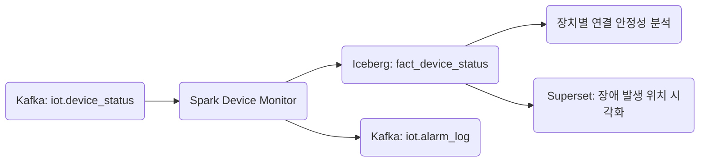

+++
title = "Flink to GCS"
draft = false
+++
## [Fact Domain] device_status

#### 도메인 개요
항목|설명
-|-
목적|센서, 로봇, 설비 등 IoT 기기의 상태 보고(ping, 지연, 오류) 및 오프라인/이상 상태 감지
보고 주기|기기별 heartbeat 주기 (30~180초)
연계 도메인|dim_device, dim_device_threshold, dim_device_error_code, alarm_log


#### 메시지 스키마(Kafka/Avro)
```json
{
  "timestamp": "2025-05-24T14:35:00Z",
  "device_id": "SENSOR_ENV_001",
  "device_type": "env_sensor",
  "location": "zone_7",
  "ip_address_hash": "0x7e239a...",  // ✅ 원본 IP는 저장 안함
  "status": {
    "ping_success": true,
    "latency_ms": 43,
    "last_success_at": "2025-05-24T14:34:30Z"
  },
  "error_code": null,
  "schema_version": "v2.0",
  "ingestion_timestamp": "2025-05-24T14:35:02Z"
}
```

#### 이상 탐지 처리 흐름(Spark)
항목|내용
-|-
기준 테이블|dim_device_threshold
Join Key|device_id, device_type
이상 조건|ping_success = false OR latency_ms > max_latency
timeout 판단|timestamp - last_success_at > timeout_threshold
timeout 계산 기준|timeout_threshold = heartbeat_cycle * 2.5
error_code 정규화|dim_device_error_code 조인으로 설명 및 심각도 분석
DLQ 조건|unit_mismatch, schema_error, timeout, error_code missing 등


#### Iceberg 저장 전략
항목|내용
-|-
테이블명|iot.fact_device_status
파티셔닝|days(timestamp), bucket(16, device_id)
중복 제거 기준|device_id + timestamp
TTL 정책|최근 90일 (단기 장애 탐지용)


#### Kafka Topic 구성
```yaml
iot.device_status:
  partitions: 8
  replication-factor: 3
  compression.type: zstd
  retention.ms: 604800000  # 7일

iot.device_status.dlq:
  partitions: 3
  retention.ms: 2592000000  # 30일
```

#### DLQ 설계
유형|조건 예시|처리 방식
-|-|-
ping 실패 (ping_success=false)|즉시 DLQ or 알람|ping_failure DLQ
latency 초과|latency_ms > 300 등|latency_violation DLQ
timeout 상태|timestamp - last_success_at > 300초 등|offline_timeout DLQ
error_code 누락|status = false인데 코드 없음|missing_error_code DLQ
invalid enum/type|schema 오류, 잘못된 device_type 등|
schema_error DLQ


#### 주요 모니터링 지표
```yaml
device_status_success_ratio
device_offline_timeout_count
device_latency_p95
device_ping_failure_count
device_error_code_distribution
```

#### SLA 기준
항목|기준
-|-
상태 보고 수집 지연 | ≤ 3초
Spark → Iceberg 적재 지연 | ≤ 10초
DLQ 비율 | ≤ 0.1%
오프라인 탐지 지연 허용 | ≤ 60초
알람 전파 지연| ≤ 2초


#### 연계 흐름



#### 관련 Dimension Table
dim_device
필드명 | 설명
-|-
device_id| 고유 ID
device_type | 센서, 로봇, 게이트웨이 등
location | 위치
install_date | 설치일
heartbeat_cycle | 보고 주기 (초)

dim_device_threshold
필드명 | 설명
-|-
device_type | 센서/로봇 구분
max_latency | 지연 임계값 (ms)
timeout_multiplier | 기본값 2.5 → timeout = heartbeat × multiplier

dim_device_error_code
필드명 | 설명
-|-
error_code|코드
description|오류 설명
severity | warning/critical
